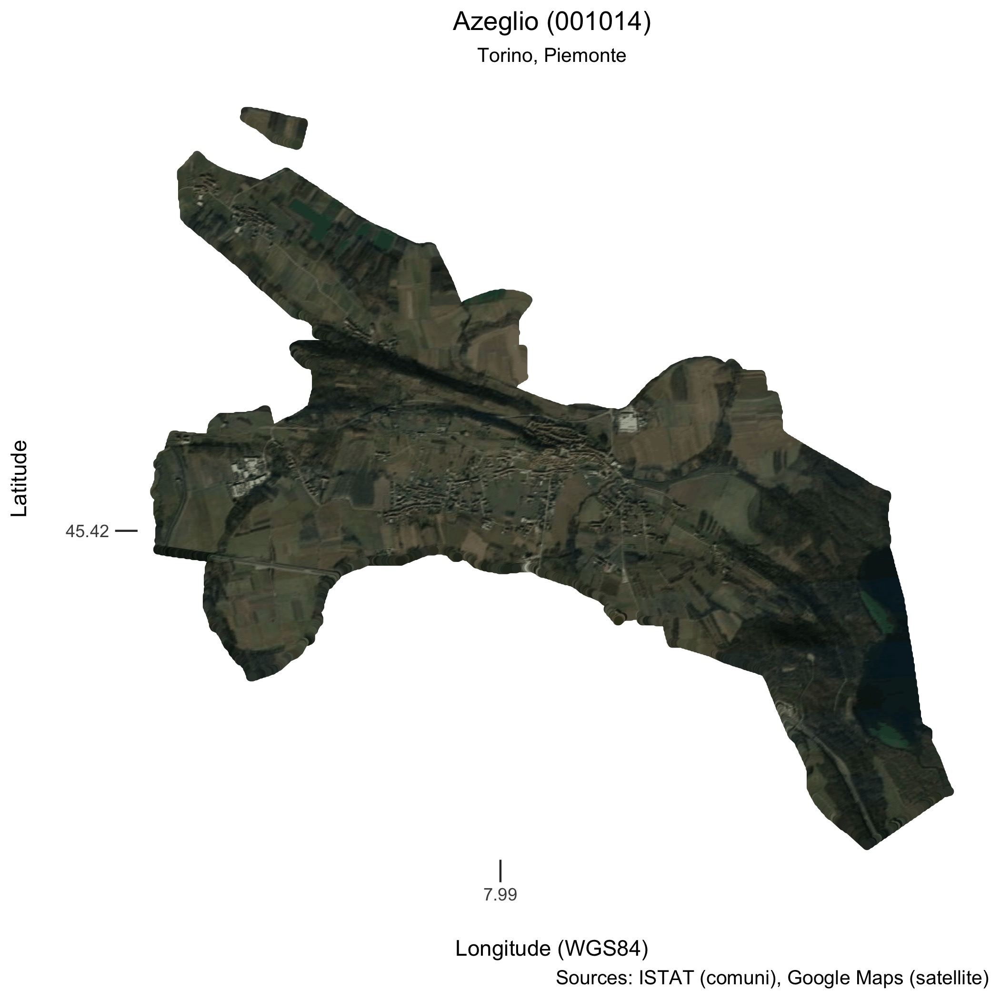

# italian-comuni-bot

** Work in progress. **

A Twitter bot written in R, see https://twitter.com/italiancomuni for actual tweets.

It tweets a map of an Italian comune together with its name, province, and region.

## Credits
* Inspired by
  - [@everytract](https://twitter.com/everytract)
  - [@GVAcartografic](https://twitter.com/GVAcartografic)'s [#Secciócensal](https://twitter.com/hashtag/Secci%C3%B3censal?src=hash)

* Automation:
  - GitHub Actions as per @mattdray's [blog post](https://www.rostrum.blog/2020/09/21/londonmapbot/).
  - {rtweet} package

* sources:
  - GIS data from ISTAT (Italian National Institute of Statistics)
  - satellite maps from [Google Maps](https://www.google.com/maps).

## How to run it

From the command line it is enough to run the following command:

    $ Rscript tweet-bot.R

This will read the index in the file `last-tweeted.txt` and tweet the next
one in the list or start over.

## ToDo's

* automation: AWS Lambda would be nice but cron will probably do for now
* plot "traveller's map" of centroid of all communi as they will be published.
